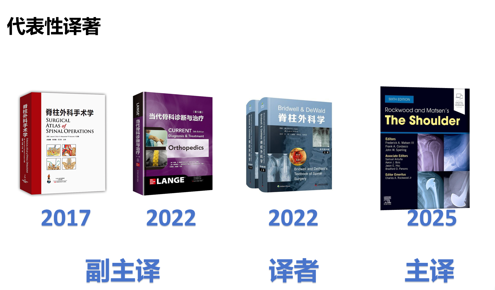

# 
韩钰 · &nbsp;骨科医学博士

  <a href=" " style="margin-right:15px;
                                  text-decoration:none;
                                  color:#0066cc;
                                  font-weight:500;">个人情况介绍</a >
  <a href="#education" style="margin-right:15px;
                              text-decoration:none;
                              color:#0066cc;
                              font-weight:500;">教育&培训经历</a >
  <a href="#research" style="margin-right:15px;
                             text-decoration:none;
                             color:#0066cc;
                             font-weight:500;">科研成果</a >
  <a href="#clinical" style="margin-right:15px;                                                                   
                             text-decoration:none;                                                                   
                             color:#0066cc;                                                                   
                             font-weight:500;">临床擅长</a >               
  <a href="#translations" style="margin-right:15px;
                                 text-decoration:none;
                                 color:#0066cc;
                                 font-weight:500;">代表性译著</a >

---

## 🩺 个人情况介绍<a id="personal-intro"></a >
医学博士&nbsp;&nbsp; &nbsp;&nbsp;九三学社&nbsp;&nbsp; &nbsp;&nbsp; 主治医师 
郑州大学第一附属医院&nbsp;&nbsp; &nbsp;&nbsp; 骨科医学部 
亚专业方向：运动医学、脊柱外科

---

## 🎓 教育&培训经历<a id="education"></a >
| 单位/机构                 | 经历类型   | 时间       |
|--------------------------|------------|------------|
| 中国人民解放军总医院（骨科）| 进修学习   | （2023）|
| 郑州大学博士后流动站（临床医学） | 博士后工作 | （2019-2021）|
| 北京大学医学部（外科学）| 博士研究生 | （2016-2019）|
| 郑州大学（外科学）| 硕士研究生 | （2013-2016）|

---

## 🔬  科研成果<a id="research"></a >
| 项目类型                   | 参与角色 | 项目编号     |
|----------------------------|----------|--------------|
| 中国博士后科学基金面上资助   | 主持     | 219M662546   |
| 河南省卫健委联合共建项目     | 主持     | LHGJ2020031  |
| 国家自然科学基金面上项目     | 参与     | 81872180     |
| 国家自然科学基金联合基金项目 | 参与     | U2004113     |

---

 ## 🏥 临床擅长 <a id="clinical"></a >

### 核心技术特色
- 🩹 微创关节镜技术：膝关节交叉韧带解剖重建、半月板缝合修复（年均完成200+台）
- 🦴 脊柱内镜技术：经皮椎间孔镜下腰椎间盘突出髓核摘除术（手术时长平均40分钟，术后次日下床）
- 🏋️ 运动损伤精准康复：结合生物力学评估，定制术后个性化康复方案

### 重点诊疗疾病
- 🦵 运动创伤：膝关节半月板损伤、交叉韧带断裂、肩关节肩袖损伤、踝关节韧带损伤
- 📌 脊柱疾病：腰椎间盘突出症（尤其青少年/中青年患者）、颈椎间盘突出症、脊柱小关节紊乱
- 💊 其他：骨关节炎阶梯治疗、肌腱炎/腱鞘炎保守与微创治疗

### 特色服务
- 🎯 运动人群专项评估：运动员/健身爱好者运动损伤风险筛查与预防指导
- ⏱️ 术后快速康复：多学科协作（骨科+康复科），缩短恢复周期30%

---
  
## 📚 代表性译著<a id="translations"></a >
| 年份 | 译著名称               | 角色   |
|------|------------------------|--------|
| 2017 | 《脊柱外科手术学》| 副主译 |
| 2022 | 《当代骨科诊断与治疗》| 译者   |
| 2022 | 《脊柱外科学》| 译者   |
| 2025 | 《The Shoulder》| 主译   |

<!-- 底部装饰条 -->

  
© 2025 韩钰 · 骨科医学博士 | 郑州大学第一附属医院骨科医学部

  

    🩺 专注运动医学与脊柱外科诊疗 · 学术与临床并行
  

